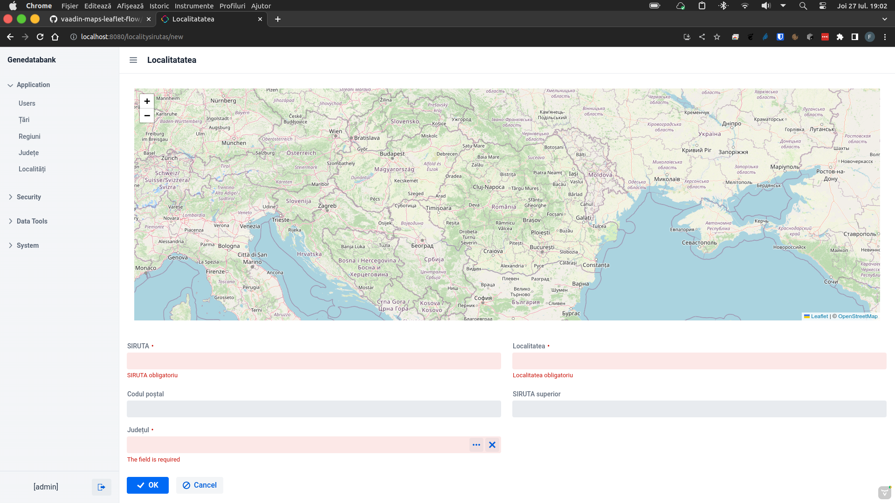

# GeneDataBank
GeneDataBank is an genetic plant database.
  
For this project I used:  
OS - Debian GNU/LINUX
Java 17 from [Amazon Corretto](https://aws.amazon.com/corretto/?filtered-posts.sort-by=item.additionalFields.createdDate&filtered-posts.sort-order=desc)  
Intellij IDEA CE from [JET BRAINS](https://www.jetbrains.com/idea/)   
Jmix 2.0 from [JMIX](https://www.jmix.io//)  

For the map I used leaflet maps, XDEV SOFTWARE working on this at [GITHUB](https://github.com/xdev-software/vaadin-maps-leaflet-flow)   
I used version 3.0.0 because with 3.0.1 I have strange errors :(
  
   
* OS is Debian GNU/LINUX with KDE and Apple Ventura theme
