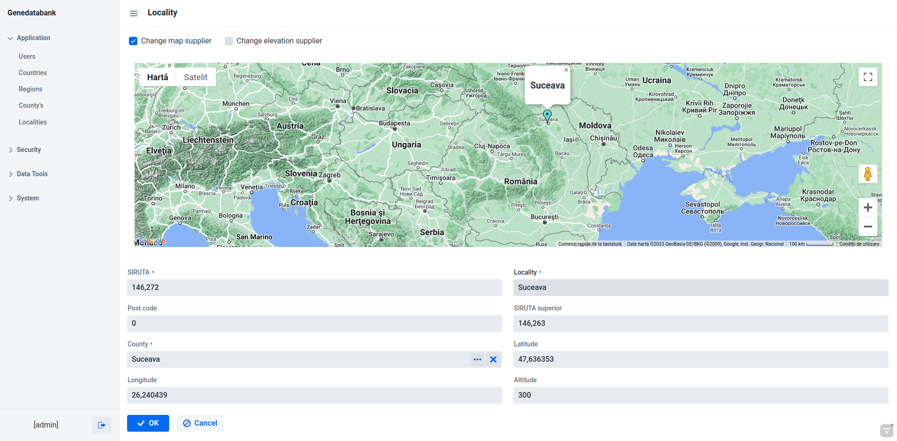

# GeneDataBank
GeneDataBank is a genetic plant software database (Work is in progress).
  
For this project I used:  
OS - [Debian GNU/LINUX](https://www.debian.org/)  
Intellij IDEA CE from [JET BRAINS](https://www.jetbrains.com/idea/) with Java 17 from [Amazon Corretto](https://aws.amazon.com/corretto/?filtered-posts.sort-by=item.additionalFields.createdDate&filtered-posts.sort-order=desc)  
Framework Jmix 2.0 from [JMIX](https://www.jmix.io//)  

For the map I used OpenStreetMap, [leaflet addon to Vaadin](https://vaadin.com/directory/component/leafletmap-for-vaadin) , XDEV SOFTWARE working on this at [GITHUB](https://github.com/xdev-software/vaadin-maps-leaflet-flow) 
and made a great work  
I used version 3.0.0 because with 3.0.1 not work, I have strange errors :(
  


and for Google Maps I used [Google Maps Addon to Vaadin](https://vaadin.com/directory/component/google-maps-addon), thank you [Flowing Code](https://www.flowingcode.com/en/) for your great work  
  
  
  

> **Warning**  
> Is need to add your api key, in the class **LocalitysirutaDetailView**, 
> from Google Maps if you wish to have the maps without watermark and with full options. 
  


For determine the altitude, I used the api and service from [Open Topo Data](https://www.opentopodata.org/) and from [Google elevation api](https://developers.google.com/maps/documentation/elevation/overview). 
For get the elevation from json response I used [Gson](https://en.wikipedia.org/wiki/Gson) library.
This is possible if not exist data information for latitude and longitude in the Locality screen when using Google Maps, 
because the marker is draggable in this case.
  
```java
public class LocalitysirutaDetailView extends StandardDetailView<Localitysiruta> {
    //...
    public int getElevation(URL url) throws IOException {
        HttpURLConnection connection = (HttpURLConnection) url.openConnection();

        connection.setRequestMethod("GET");
        connection.setRequestProperty("Content-Type", "application/json");
        connection.setRequestProperty("Accept", "application/json");

        double elevation = 0;

        try (BufferedReader bufferedReader = new BufferedReader(
                new InputStreamReader(connection.getInputStream(), StandardCharsets.UTF_8))) {
            StringBuilder response = new StringBuilder();
            String responseLine;
            while ((responseLine = bufferedReader.readLine()) != null) {
                response.append(responseLine.trim());
            }
            JsonObject jsonObject = new Gson().fromJson(response.toString(), JsonObject.class);
            JsonArray jsonArray = jsonObject.getAsJsonArray("results");

            String status = jsonObject.get("status").toString();

            if (!status.equals("\"OK\"")) {
                String error_message = messageBundle.getMessage("error_message");
                notifications.create(error_message+" "+status).show();
            } else {
                JsonObject jsonObject1 = new Gson().fromJson(jsonArray.asList().get(0).toString(), JsonObject.class);

                String elev = String.valueOf(jsonObject1.get("elevation"));
                elevation = Double.parseDouble(elev);
            }
        }
        return (int) elevation;
    }
}
```

The code easy to be adapted to use Google services for elevation because the URL request and the json answer have the 
same form:  
  
Request for Google services  

```html
https://maps.googleapis.com/maps/api/elevation/json?locations=39.7391536,-104.9847034&key=apiKey
```  
Answer from Google services
```json
{
   "results" : 
   [
      {
         "elevation" : 1608.637939453125,
         "location" : 
         {
            "lat" : 39.7391536,
            "lng" : -104.9847034
         },
         "resolution" : 4.771975994110107
      }
   ],
   "status" : "OK"
}
```  
Request for Open Topo Data  services
```html
https://api.opentopodata.org/v1/mapzen?locations=39.7391536,-104.9847034
```
Answer from Open Topo Data services  
```json
{
  "results": [
    {
      "dataset": "mapzen", 
      "elevation": 1609.0, 
      "location": {
        "lat": 39.7391536, 
        "lng": -104.9847034
      }
    }
  ], 
  "status": "OK"
}
```
  

