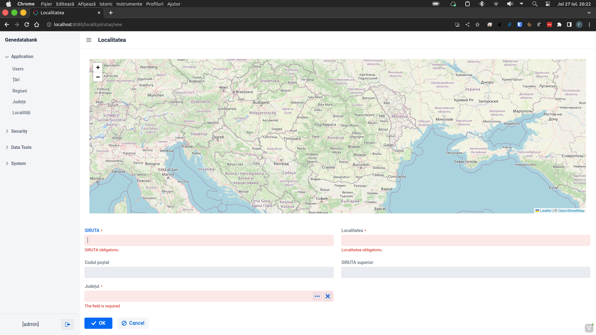

# GeneDataBank
GeneDataBank is an genetic plant database.
  
For project I used:  
Java from https://aws.amazon.com/corretto/?filtered-posts.sort-by=item.additionalFields.createdDate&filtered-posts.sort-order=desc  
Intellij IDEA CE from https://www.jetbrains.com/idea/   
Jmix from https://www.jmix.io/  

For map I used https://github.com/xdev-software/vaadin-maps-leaflet-flow version 3.0.0 with 3.0.1 I have strage errors :(
  

