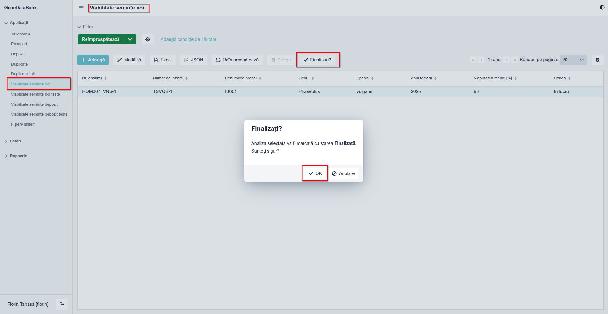

# Instalare

## Compilarea din surse în sistemul de operare Linux

Pentru instalarea aplicației din surse, într-un terminal din sistemul nostru sau printr-o 
conexiune la distanță, este necesară parcurgerea următorilor pași:  

* realizarea unui director denumit **git** și schimbarea căii de lucru în el:  

```bash
mkdir ~/git & cd ~/git
```
  
* clonarea surselor aferente aplicație, din https://github.com/florintanasa/genedatabank, în sistem:  
```bash
git clone https://github.com/florintanasa/genedatabank
```
  
* mutarea în directorul nou creat:  
```bash
cd genedatabank
```
  
* compilarea și realizarea fișierul binar:  
```bash
./gradlew -Pvaadin.productionMode=true bootJar
```
  
* fișierul binar (la momentul scrierii acestui manual este versiunea 0.2.0 a lui genedatabank) va fi realizat în 
directorul **build/libs**:  
```bash
ls build/libs/
genedatabank-0.2.0-SNAPSHOT.jar
```  
Pentru siguranța sistemului este recomandat ca aplicația să fie rulată de către un utilizator creat numai în acest scop,
neavând drept de logare și de acces la consolă.  
Acestea vor fi prezentate în următorul punct.

### Instalarea aplicației în sistemul de operare Linux
  
Pentru instalare este necesar accesul deplin la sistem ca utilizator **root** ori utilizatorul nostru să poată 
folosi comanda **sudo**. În continuare, este realizat (configurat) un utilizator cu denumirea  **genedatabank** cu 
directorul **_home_** în **/opt/genedatabank**:
```bash
sudo useradd -r -m -U -d /opt/genedatabank -s /bin/false genedatabank
```

Comanda de mai sus reprezintă:  

* **-r** va crea un utilizator în sistem  denumit **genedatabank**;
* **-U** va crea grupul denumit **genedatabank**;
* **-m** va crea directorul **_home_** dacă nu există;
* **-d** va seta directorul **_home_** în **/opt/genedatabank**;
* **-s** va seta ca și consolă de logare nimic **/bin/false**, utilizatorul va fi scos automat afară;  

După rularea comenzii de mai sus se poate copia aplicația noastră în directorul **_home_** al utilizatorului creat 
pentru acest scop:  
```bash
sudo cp ~/git/genedatabank/build/libs/genedatabank-0.2.0-SNAPSHOT.jar /opt/genedatabank/
```

După copiere, se impune schimbarea proprietarul fișierului binar pentru utilizatorul și grupul **genedatabank** nou 
creat, care va rula aplicația:  
```bash
sudo chown genedatabank:genedatabank /opt/genedatabank/genedatabank-0.2.0-SNAPSHOT.jar
```

### Pornirea serviciului GeneDataBank cu ajutorul unui manager de servicii  

În acest scop folosim *_systemd_* și pentru care realizăm un fișier de configurare:  
```bash
sudo nano /etc/systemd/system/genedatabank.service
```  
În care introduce următorul conținut:  
```text
[Unit]
Description=GeneDataBank java server application
# depend by network and postgres
Wants=network-online.target postgresql.service
# start after network  and postgres service start
After=network-online.target postgresql.service

[Service]
# run as user genedatabank (need to exist before)
User=genedatabank
# from group genedatabank (need to exist before)
Group=genedatabank
# restart always
Restart=always
# activation state
Type=simple
# working directory for user (in this case the home is /opt/genedatabank)
WorkingDirectory=/opt/genedatabank/
# execute command to start the application
ExecStart=/usr/lib/jvm/java-17-openjdk-amd64/bin/java \
    -Xmx3072m -server -XX:+UseShenandoahGC -XX:+HeapDumpOnOutOfMemoryError -XX:HeapDumpPath=/tmp/heapdump.bin -jar \
    /opt/genedatabank/genedatabank.jar \
    --spring.profiles.active=production \
    --server.port=8090
# send stdout to syslog
StandardOutput=syslog
# send stderr to syslog
StandardError=syslog
# identifier for syslog
SyslogIdentifier=genedatabank

[Install]
WantedBy=multi-user.target
```
Instalăm pachetul **rsyslog**, dacă nu este instalat în sistem:  
```bash
 sudo apt install rsyslog
```
Pornirea serviciului va deschide portul 8090 pentru acces, iar serviciul va fi monitorizat de către **_syslog_**
într-un fișier **genedatabank.log** în directorul **/var/log**.  
Pentru acestea informăm **syslog** prin crearea unui fișier de configurare:  
```bash
sudo nano /etc/rsyslog.d/genedatabank.conf
```  
În care edităm următorul conținut:  
```text
if $programname == 'genedatabank' then /var/log/genedatabank.log
& stop
```
după care se realizează fișierul pentru log-uri:  
```bash
sudo touch /var/log/genedatabank.log
```
în continuare se va schimba proprietarul și grupul fișierului creat anterior:  
```bash
sudo chown syslog:adm /var/log/genedatabank.log
```
Pentru ca **syslog** să știe de noul fișier va trebui să repornim serviciul:  
```bash
sudo systemctl restart rsyslog
```
Pentru a nu modifica la fiecare update fișierul de configurare **genedatabank.service** de pornire a serviciului se va 
realiza o legătură simbolică la fișierul **genedatabank-0.2.0-SNAPSHOT.jar** denumită **genedatabank.jar**:  
```bash
sudo -u genedatabank ln -sf /opt/genedatabank/genedatabank-0.2.0-SNAPSHOT.jar /opt/genedatabank/genedatabank.jar
```
> **ATENȚIE!**  
> 
> Pentru a continua, va trebui să existe instalat și pornit serviciul bazei de date PostgreSQL, în care a fost creat  
> un utilizator **svgenebank** cu parola **geneit** și care va fi proprietarul bazei de date **genedatabank**  
> 
> ```postgresql
> create role svgenebank with login createdb password 'geneit';
> create database genedatabank owner svgenebank;
> ```
> Modificarea utilizatorului, parolei și a bazei de date se face în fișierul **src/main/resources/application.properties** 

În final, putem porni serviciul folosind comanda:  
```bash
sudo systemctl start genedatabank.service
```
După care se va verifica folosind comanda:  
```bash
systemctl status genedatabank.service
```
pentru a vedea dacă a pornit corect, iar pentru a vedea un log mai extins folosim:  
```text
sudo tail -F /var/log/genedatabank.log
```

Pentru ca serviciul să pornească automat, la pornirea calculatorului/serverului, folosim comanda:  
```bash
sudo systemctl enable genedatabank.service
```
> **ATENȚIE**
> Pentru listarea de rapoarte, etichete, etc va trebui să existe instalat în sistem **Libreoffice** și configurată 
> calea, consultați fișierul **src/main/resources/application.properties**
> 
**De continuat (calea către codurile QR și calea către imaginile urcate în server)**

# Viabilitate semințe noi
Formularul este utilizat pentru vizualizarea și înregistrarea analizelor și testelor de viabilitate (germinare).

## Înregistrarea unei analize
Pentru înregistrarea unei noi analize se alege meniul **Viabilitate semințe noi** ca în figura de mai jos:  


După alegerea meniului se va deschide următorul ecran:  


Aici vom putea vizualiza, modifica și adăuga noi analize aferente unei noi probe sau eșantion fie el cu număr temporar sau nu.

### Adăugarea unei analize
Pentru a adăuga o nouă analiză se apasă butonul **Adaugă**, evidențiat în figura de mai jos:  


moment în care se va deschide un nou ecran, prin care suntem informați, că este necesar alegerea probei de analizat după **Nr. de intrare**, câmpul fiind obligatoriu, ca în figura de mai jos: 


Celelalte câmpuri sunt de tip **numai citire**, deoarece vor fi completate automat, ca urmare a acțiunilor viitoare, ale utilizatorului conectat. De exemplu s-a ales proba cu numărul de intrare SVGB-1, pentru care dorim să realizăm analiza de viabilitate (germinație):


În cadrul fiecărei analize, aferentă unui **Nr. de intrare**, se vor adăuga teste, cu ajutorul butonului **Adaugă**, evidențiat mai jos:  


moment în care se va deschide un nou ecran, ca în imaginea de mai jos:  


după cum se observă câmpul cu **Nr. de semințe testate** este obligatoriu. Câmpul acceptă numai numere întregi pozitive (mai mari ca zero). Câmpul **Data punerii la germinat** este obligatoriu și el, este de tip dată și se completează automat cu data curentă.

Pentru exemplu de față considerăm că la testare au fost puse la germinat 50 de semințe în dată 08/10/2024, iar **Data evaluării germinației** a fost 18/10/2024, ecranul nostru va fi completat ca mai jos:


Observăm că o parte din câmpuri sunt de tip **numai citire** și au fost completate automat:  

* **Viabilitate [%]** - reprezintă calculul în procente al viabilității, raportat la nr. de semințe puse la germinat;
*  **Durata germinației [zile]** - reprezintă durata de timp, între data punerii la germinat și data analizei germinației;

Câmpul **Durata tratamentului [zile]**, este de tip întreg pozitiv și se completează cu numărul de zile aferente unui eventual tratament, iar la câmpul **Observații** se poate detalia cu ceea ce considerăm necesar, ca de exemplu nr. și tipul de tratamente (fizice - pre-răcire, chimice - tratarea cu anumite substanței, etc.), câmpul este nelimitat la nr. de caractere.  

Pentru adăugare, se apasă butonul **OK**, iar testul nostru va fi adăugat în lista aferentă probei, cu **Nr. de intrare** SVGB-1.


Pentru salvarea efectivă a testului, la analiza probei cu **Nr. de intrare** SVGB-1, va trebui să apăsăm butonul **OK**, ca mai jos:  


Înainte de salvare analiza va primi o serie și un număr, ca în imaginea de mai jos:  
  


Câmpurile aferente unei analize sunt:  
  
* **Nr. analizei** - format din serie și număr, se completează și se indexează automat;
* **Număr de intrare** - reprezintă numărul de intrare aferent probei (eșantionului) supus determinării viabilității;
* **Anul testării** - reprezintă anul în care proba a fost supusă determinării viabilității, se completează automat cu anul curent; 
* **Viabilitatea medie [%]** - reprezintă viabilitatea medie, în [%], pentru calcul se utilizează toate testele din lista aferentă analizei;
* **Stare** - reprezintă starea în care se află analiza **În lucru** sau **Finalizat**; 

> **Atenție**
  >
> **Viabilitatea medie [%]** ține cont de toate testele din cadrul analizei. În cazul în care există un test aflat în desfășurare acesta va influență valoarea viabilității deoarece se consideră viabilitatea minimă posibilă **0** și este luat în calcul, ca în figura de mai jos:


După cum se observă introducerea parțială a unui nou test va influența calculul valorii medii a viabilității.  

Pentru protecție butonul **Finalizare** este invalidat dacă există cel puțin un test, aferent unei analize, pentru care nu s-a calculat viabilitatea, ca în figura de mai jos:  


### Finalizarea unei analize

Pentru a finaliza o analiză, va trebui să avem toate testele din cadrul ei complete, astfel la testul de mai sus va fi necesar a completa cu evaluare germinației, apăsând butonul **Modifică** și vom intra în lista cu teste, unde vom alege testul nostru parțial, urmând a fi completat, ca în figura de mai jos: 


După cum se observă, se realizează iarăși calcul viabilității medii, dar de această dată folosind și contribuția viabilității testului/repetiției 2.

La o analiză, se pot realiza câte teste sau repetiții se consideră a fi necesare, la calcularea viabilității medii se va ține cont de toate.

Cu toate testele finalizate, programul va activa butonul **Finalizare**, ca în figura de mai jos:  


> **Atenție** 
> Un utilizator nu poate **Finaliza** analiza **În lucru**, chiar dacă este completă al altui utilizator și nici nu o poate modifică. În schimb este posibilă vizualizarea.  


în cazul de mai sus, analiza **ROM007_VNS-9** aparține altui utilizator.  

După apăsarea butonului **Finalizare**, se va schimba automat **Starea** în **Finalizat** , ca în imaginea de mai jos:  



 inițial, vom fi avertizați că marcăm ca **Finalizat** analiza, iar dacă suntem de acord și apăsăm butonul **OK**  atunci analiza va fi marcată ca și **Finalizat**, iar analiza nu va mai putea fi modificată, dar va putea fi vizualizată, ca în imaginea de mai jos:  


