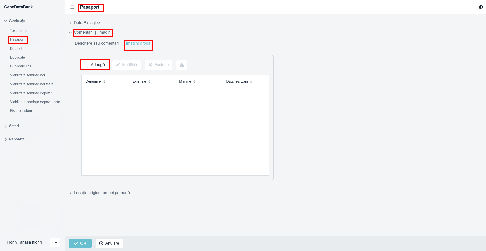
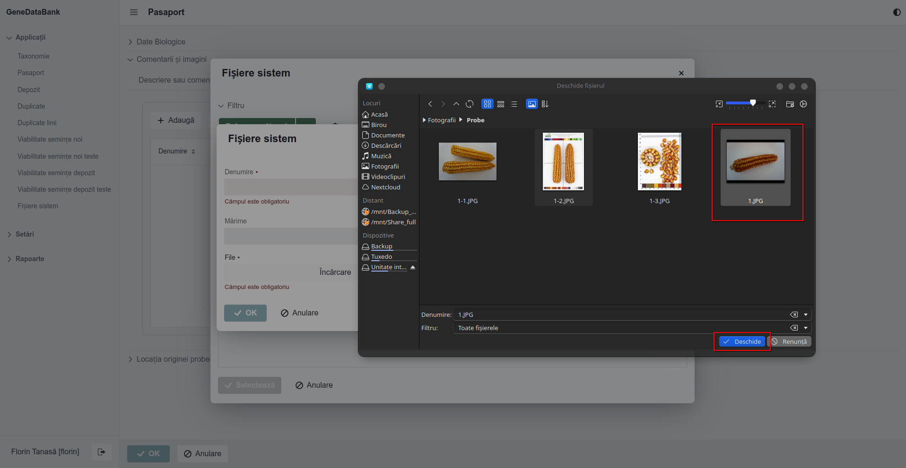

# Instalare

## Compilarea din surse în sistemul de operare Linux

Pentru instalarea aplicației din surse, într-un terminal din sistem sau printr-o 
conexiune la distanță, este necesară parcurgerea următorilor pași:  

* realizarea unui director denumit **git** și schimbarea căii de lucru în el:  

```bash
mkdir ~/git & cd ~/git
```
  
* clonarea surselor aferente aplicație, din https://github.com/florintanasa/genedatabank, în sistem:  
```bash
git clone https://github.com/florintanasa/genedatabank
```
  
* mutarea în directorul nou creat:  
```bash
cd genedatabank
```
  
* compilarea și realizarea fișierul binar:  
```bash
./gradlew -Pvaadin.productionMode=true bootJar
```
  
* fișierul binar (la momentul scrierii acestui manual este versiunea 0.2.0 a lui genedatabank) va fi realizat în 
directorul **build/libs**:  
```bash
ls build/libs/
genedatabank-0.2.0-SNAPSHOT.jar
```  
Pentru siguranța sistemului este recomandat ca aplicația să fie rulată de către un utilizator creat numai în acest scop,
neavând drept de logare și de acces la consolă.  
Acestea vor fi prezentate în următorul punct.

### Instalarea aplicației în sistemul de operare Linux
  
Pentru instalare este necesar accesul deplin la sistem ca utilizator **root** ori utilizatorul nostru să poată 
folosi comanda **sudo**. În continuare, este realizat (configurat) un utilizator cu denumirea  **genedatabank** cu 
directorul **_home_** în **/opt/genedatabank**:
```bash
sudo useradd -r -m -U -d /opt/genedatabank -s /bin/false genedatabank
```

Comanda de mai sus reprezintă:  

* **-r** va crea un utilizator în sistem  denumit **genedatabank**;
* **-U** va crea grupul denumit **genedatabank**;
* **-m** va crea directorul **_home_** dacă nu există;
* **-d** va seta directorul **_home_** în **/opt/genedatabank**;
* **-s** va seta ca și consolă de logare nimic **/bin/false**, utilizatorul va fi scos automat afară;  

După rularea comenzii de mai sus se poate copia aplicația noastră în directorul **_home_** al utilizatorului creat 
pentru acest scop:  
```bash
sudo cp ~/git/genedatabank/build/libs/genedatabank-0.2.0-SNAPSHOT.jar /opt/genedatabank/
```

După copiere, se impune schimbarea proprietarul fișierului binar pentru utilizatorul și grupul **genedatabank** nou 
creat, care va rula aplicația:  
```bash
sudo chown genedatabank:genedatabank /opt/genedatabank/genedatabank-0.2.0-SNAPSHOT.jar
```

### Pornirea serviciului GeneDataBank cu ajutorul unui manager de servicii  

În acest scop este folosit *_systemd_* pentru care se realizează un fișier de configurare:  
```bash
sudo nano /etc/systemd/system/genedatabank.service
```  
În care se introduce următorul conținut:  
```text
[Unit]
Description=GeneDataBank java server application
# depend by network and postgres
Wants=network-online.target postgresql.service
# start after network  and postgres service start
After=network-online.target postgresql.service

[Service]
# run as user genedatabank (need to exist before)
User=genedatabank
# from group genedatabank (need to exist before)
Group=genedatabank
# restart always
Restart=always
# activation state
Type=simple
# working directory for user (in this case the home is /opt/genedatabank)
WorkingDirectory=/opt/genedatabank/
# execute command to start the application
ExecStart=/usr/lib/jvm/java-17-openjdk-amd64/bin/java \
    -Xmx3072m -server -XX:+UseShenandoahGC -XX:+HeapDumpOnOutOfMemoryError -XX:HeapDumpPath=/tmp/heapdump.bin -jar \
    /opt/genedatabank/genedatabank.jar \
    --spring.profiles.active=production \
    --server.port=8090
# send stdout to syslog
StandardOutput=syslog
# send stderr to syslog
StandardError=syslog
# identifier for syslog
SyslogIdentifier=genedatabank

[Install]
WantedBy=multi-user.target
```
Se instalează pachetul **rsyslog**, dacă nu există în sistem:  
```bash
 sudo apt install rsyslog
```
Pornirea serviciului va deschide portul 8090 pentru acces, iar serviciul va fi monitorizat de către **_syslog_**
într-un fișier **genedatabank.log** în directorul **/var/log**.  
Pentru acestea informăm **syslog** prin crearea unui fișier de configurare:  
```bash
sudo nano /etc/rsyslog.d/genedatabank.conf
```  
În care edităm următorul conținut:  
```text
if $programname == 'genedatabank' then /var/log/genedatabank.log
& stop
```
după care se realizează fișierul pentru log-uri:  
```bash
sudo touch /var/log/genedatabank.log
```
Se va schimba proprietarul și grupul fișierului creat anterior:  
```bash
sudo chown syslog:adm /var/log/genedatabank.log
```
Pentru ca **syslog** să știe de noul fișier va trebui efectuată repornirea serviciului:  
```bash
sudo systemctl restart rsyslog
```
Pentru a nu modifica la fiecare update fișierul de configurare **genedatabank.service** de pornire a serviciului se va 
realiza o legătură simbolică la fișierul **genedatabank-0.2.0-SNAPSHOT.jar** denumită **genedatabank.jar**:  
```bash
sudo -u genedatabank ln -sf /opt/genedatabank/genedatabank-0.2.0-SNAPSHOT.jar /opt/genedatabank/genedatabank.jar
```
> **ATENȚIE!**  
> 
> Pentru a continua, va trebui să existe instalat și pornit serviciul bazei de date PostgreSQL, în care a fost creat  
> un utilizator **svgenebank** cu parola **geneit** și care va fi proprietarul bazei de date **genedatabank**  
> 
> ```postgresql
> create role svgenebank with login createdb password 'geneit';
> create database genedatabank owner svgenebank;
> ```
> Modificarea utilizatorului, parolei și a bazei de date se face în fișierul **src/main/resources/application.properties** 

În final, putem porni serviciul folosind comanda:  
```bash
sudo systemctl start genedatabank.service
```
După care se va verifică folosind comanda:  
```bash
systemctl status genedatabank.service
```
Iar pentru a vedea un log mai extins folosim comanda:  
```text
sudo tail -F /var/log/genedatabank.log
```

Dacă se vrea ca serviciul să pornească automat, la pornirea calculatorului/serverului, folosim comanda:  
```bash
sudo systemctl enable genedatabank.service
```
> **INFO**  
> 
> La prima pornire a serviciului se va popula baza de date cu structura necesară și cu o parte din datele necesare. 


> **ATENȚIE**  
> 
> Pentru listarea de rapoarte, etichete, etc va trebui să existe instalat în sistem **Libreoffice** și configurată 
> calea către program, consultați fișierul **src/main/resources/application.properties**
>  

Pentru a lista fișierele din directorul **_home_**, al utilizatorului **_genedatabank_**, se va rula comanda:
```bash
sudo -u genedatabank ls -lah /opt/genedatabank/
```
Rezultat comenzii va fi de forma:

```txt
total 207M
drwxr-x--- 1 genedatabank genedatabank  256 ian 27 09:01 .
drwxr-xr-x 1 root         root          140 ian 23 10:22 ..
-rw-r--r-- 1 genedatabank genedatabank  220 mar 31  2024 .bash_logout
-rw-r--r-- 1 genedatabank genedatabank 3,7K mar 31  2024 .bashrc
drwxr-xr-x 1 genedatabank genedatabank  156 ian  8 07:29 .config
-rw-r--r-- 1 genedatabank genedatabank 4,0K sep 29  2022 .face
lrwxrwxrwx 1 genedatabank genedatabank   23 nov 25 19:15 .face.icon -> /opt/genedatabank/.face
-rw-r--r-- 1 genedatabank genedatabank 207M ian 22 13:16 genedatabank-0.2.0-SNAPSHOT.jar
lrwxrwxrwx 1 genedatabank genedatabank   49 ian 22 14:43 genedatabank.jar -> /opt/genedatabank/genedatabank-0.2.0-SNAPSHOT.jar
-rw-r--r-- 1 genedatabank genedatabank  140 nov 27  2021 .inputrc
drwxr-xr-x 1 genedatabank genedatabank    8 ian 22 14:48 .jmix
-rw-r--r-- 1 genedatabank genedatabank 1,7K apr  2  2024 .mkshrc
-rw-r--r-- 1 genedatabank genedatabank  807 mar 31  2024 .profile
-rw------- 1 genedatabank genedatabank   96 ian 27 09:01 .xauthr0OB0p

```

> **INFO**
> 
> În directorul **/opt/genedatabank/.jmix/work/filestorage** vor fi salvate fișierele încărcate în aplicație. În 
> baza de date vor fi salvate numai referințele generate în câmpul ID, care este cheie primară și este de tip UID. 
> Codul QR este generat în directorul **/opt/genedatabank/qrCodeImage**, directorul este creat automat, dacă nu există, 
> la prima generare de cod QR. Important de știut că în momentul în care este încărcat în aplicație fișierul cu imaginea
> codului QR va fi șters din acest director, practic va fi mutat în **/opt/genedatabank/.jmix/work/filestorage**.
> În directorul **/opt/genedatabank/.jmix/work/filestorage** informația (fișierele) sunt ținute în directoare pe ani, 
> luni și zile, de exemplu un fișier urcat în data de _25.01.2025_, va fi regăsit în locația: 
> **/opt/genedatabank/.jmix/work/filestorage/2025/01/25**


# Prima utilizare

Conectarea la server se realizează cu un browser web (de exemplu: chrome sau firefox) ca și client, folosind în bara de 
adrese IP-ul unde a fost pornit serviciul **genedatabank** și respectiv portul utilizat de acesta, în acest caz **8090**
, de exemplu http://localhost:8090/login, iar pentru autentificare inițială se vor completa câmpurile pentru Utilizator 
**admin** și Parola **admin**:  
  
  
  
Urmând a fi schimbată după logare din meniul _Aplicații_->_Utilizatori_  
Completarea sau modificarea informațiilor, aferente unui utilizator existent, în acest caz **admin**, se realizează din
accesarea meniului _Aplicații_->_Utilizatori_ 
  
  
  
După care se va deschide o nouă pagină a utilizatorului **admin** unde se vor completa/modifica unele informații:  
  
  
  
În acest caz a fost definită zona de timp.  

>**INFO**
> 
> Pentru utilizatorul **admin** este de preferat de a nu fi înregistrat într-o **Instituție** deoarece vizualizarea unor 
> informații vor fi accesibile pentru un utilizator numai pentru acelea înregistrate de utilizatorii arondați
> unei anumite **Instituții**.

Modificarea parolei unui utilizator se realizează din meniul _Aplicații_->_Utilizatori_->_Adițional_->_Schimbare parolă_: 
  
  
  
## Definirea unor parametrii unici aferenți fiecărei Instituției ce utilizează baza de date  

La prima utilizare vor trebui definite constantele (seriilor) aferente fiecărei Instituții ce dorește a utilizarea bazei 
de date. Definirea acestora se va realiza din meniul _Setări_->_Administrative_->_Instituții_->_Adaugă_ sau _Modifică_. 
În imaginea de mai jos, are loc vizualizarea unei **Instituții** existente ce are datele de identificare complete:  
  
  
  
> **ATENȚIE**
> 
> Unele câmpuri trebuie să fie unice, ca de exemplu: **Cod**, **Serial pentru nr. de intrare**, **Serial pentru nr. 
> temporar de intrare**, **Serial VOS**, **Serial VNS**
  
Câmpurile de mai sus reprezintă:  

* **Cod** - este codul aferent fiecărui Institut înregistrat la FAO;
* **Serial pentru nr. de intrare** - reprezintă seria codului unic acordat probelor aferente unui Institut;
* **Serial pentru nr. temporar de intrare** - reprezintă seria codului unic al probelor temporare aferente unui Institut;
* **Serial VOS** - reprezintă seria codului al determinării viabilității la semințele existente în depozit (Viability Old 
Seeds);
* **Serial VNS** - reprezintă seria codului al determinării viabilității la semințele noi intrate în Institut (Viability 
New Seeds);


> **INFO**
> 
> Câmpurile **Cheia api pentru Google Maps**, **Serial pentru nr. de intrare**, **Serial pentru nr.
> temporar de intrare**, **Serial VOS**, **Serial VNS** pot fi vizualizate și modificate numai de către utilizatorul
> **admin**. În plus, pentru o protecție la vizualizări accidentale de date sensibile, precum cheia api la Google Maps 
> acest câmp a fost mascat.  
> **Utilizatorii vor putea folosi numai cheia aferentă Instituției în care este arondat.**
> Utilizatorul **admin** _nu va putea folosi hărțile de la Google Maps_, deoarece nu este arondat unei instituții, în schimb
> va putea utiliza hărțile de la OpenStreetMaps, acestea fiind definite pentru folosirea implicită.


# Adăugarea unui utilizator  

În vederea operării aplicației se vor putea înregistra **utilizatori** unici. Introducerea unui utilizator nou se 
realizează din meniul _Aplicații_->_Utilizatori_->_Adaugă:  


  
Exemplu pentru adăugarea unui utilizator se prezintă în imaginea de mai jos:  


După apăsarea butonului **OK**, utilizatorul va fi salvat și va apărea în listă:  

  

# Atribuirea rolurilor unui utilizator

Politica de acces la informații: meniuri, formulare, butoane, câmpuri etc. se realizează cu ajutorul rolurilor definite
prin cod sau prin configurarea unor roluri în baza de date.  
Pentru a atribui roluri se selectează utilizatorul dorit și se apăsa butonul _Afișare asignări roluri_, din meniul 
_Aplicații_->Utilizatori_:  


Se va deschide o nouă pagină denumită **Atribuiri roluri pentru _Prenume Nume [utilizator]_ de unde putem atribui roluri 
pentru:
* **Permisiuni resursă**
  * drept de logare; 
  * acces la meniuri;
  * acces pentru introducere;
  * acces pentru vizualizare;
  * acces pentru ștergere;
  * etc.
* **Permisiuni nivel de rând**
  * acces la informațiile ce conține anumite informații, de exemplu:
    * vizualizarea numai a probelor din Pașaport care sunt declarate neconfidențiale;
  * etc.

De exemplu, prin apăsarea butonului **Permisiuni resursă** se va deschide o nouă fereastră, de unde se aleg rolurile 
care sunt atribuite **utilizatorului**, ca în imaginea de mai jos:  


Prin apăsarea butonului **Permisiuni nivel de rând** se va deschide o altă fereastră, de unde se aleg rolurile atribuite 
**utilizatorului**. De exemplu **Institution and users** este rolul ce permite utilizatorului vizualizarea înregistrărilor 
aferente doar **Institutului** din care face parte.


În final pagina utilizatorului va cuprinde listele cu rolurile atribuite acestuia, ca în imaginea următoare:  


Listă ce va fi salvată prin apăsarea butonului **OK**.

# Pașaport

În meniul **Pașaport** se înregistrează probele ce vor intra în **Institut** spre păstrare, multiplicare, cercetare etc.  
O probă poate fi înregistrată cu număr temporar sau cu număr definitiv. Numerele sunt generate automat de către baza de 
date în sens crescător, fiind formate din :
* **Serial pentru nr. de intrare** - **nr. de ordine**, de exemplu SVGB-1;
* **Serial pentru nr. temporar de intrare** - **nr. de ordine**, de exemplu TSVGB-1;

Seriile au fost atribuite anterior, la pasul **Definirea unor parametrii unici aferenți fiecărei Instituției ce utilizează
baza de date**.  
După accesul în aplicație, la adresele unde se află aplicația **GeneDataBank**, se deschide o pagină, ca mai jos:


## Accesarea paginii Pașaport

Pagina **Pașaport** poate fi vizualizată din meniul _Aplicații_->_Pașaport_:


## Introducerea unei probe

Pentru introducerea unei probe este necesar parcurgerea următorilor pași:  

* Se apasă butonul **Adaugă**:  


* Se va deschide o pagină cu câmpurile necesare a fi introduse:


  
În care sunt următoarele câmpuri:

  * **Institutul păstrător** - Reprezintă **Institutul** care va păstra proba. Se completează automat, deoarece este 
același cu **Institutul** din care face parte **utilizatorul**. Institutul păstrător este introdus, dacă acesta nu 
există, prin accesarea meniului _Setări_->_Administrative_->_Instituții_. Prin interogări se poate obține codul 
**INSTCODE** din descriptorii EURISCO;
  * **Număr de intrare temporar** - Este o căsuță de dialog. În cazul în care este bifată se va genera un număr de
intrare temporar. În cazul introducerii unei probe cu număr definitiv nu se va bifa. După salvare, dacă proba a fost 
marcată ca fiind definitivă, căsuța va fi invalidată (nu se mai poate schimba starea), iar dacă proba a fost marcată temporară, 
căsuța va rămâne validă (se poate modifica starea). 
  * **Număr intrare** - Este numărul de intrare definitiv atribuit probei și reprezintă **ACCENUMB** din descriptorii 
EURISCO;
  * **Număr temporar** - Este numărul intrare definitiv atribuit probei. Acesta va fi completat automat, cu numărul 
probei temporare, în momentul în care se scoate bifa de la **Număr de intrare temporar**. Astfel se va păstra și numărul
temporar al probei;
  * **PUID/DOI** - Identificator unic persistent (PUID) / Identificator digital de obiecte (DOI). Orice identificator 
persistent, unic, atribuit probei, astfel încât să poată fi referit fără ambiguitate la nivel global și informațiile 
asociate cu acesta sunt recoltate prin mijloace automate. Raportați câte un PUID pentru fiecare probă. 
Secretariatul Tratatului Internațional privind Resursele Fitogenetice pentru Alimentație și Agricultură (PGRFA) 
facilitează atribuirea unui identificator unic persistent (PUID), sub forma unui DOI (Identificator Digital de Obiecte),
către PGRFA la nivel de probă (https://www.fao.org/plant-treaty/areas-of-work/global-information-system/doi/en/). 
Băncile de gene care nu aplică un PUID adevărat aderărilor lor ar trebui să utilizeze și să solicite destinatarilor să 
utilizeze concatenarea descriptorilor INSTCODE (codul institutului), ACCENUMB (numărul de intrare) și GENUS 
(genul probei) ca identificator unic la nivel global, similar în cele mai multe privințe cu PUID ori de câte ori fac 
schimb de informații despre probe cu terți (de exemplu:ROM007:SVGB-20205:ZEA).
  * **Număr colectare** - Numărul de colectare. Identificatorul original alocat de colector(ii) eșantionului, compus în 
mod normal din numele sau inițialele colector(ilor) urmate de un număr (de exemplu: "DS0032"). Acest identificator este 
esențial pentru identificarea duplicatelor deținute în diferite colecții. Reprezintă câmpul **COLLNUMB** din 
descriptorii EURISCO;
  * **Taxonomia** - Gen-Specia-Autorul speciei-Subtaxa-Autorul subspeciei-Denumirea comună a culturii;
    * **Gen**: nume de gen pentru taxon. Este necesară litera majusculă inițială. Reprezintă câmpul **GENUS** din
      descriptorii EURISCO;
    * **Specie**: porțiune de epitet specifică a numelui științific cu litere mici. Este permisă doar următoarea 
abreviere:"sp.". Reprezintă câmpul **SPECIES** din descriptorii EURISCO;
    * **Autor**: autoritate specie. Furnizați autoritatea pentru numele speciei. Reprezintă câmpul **SPAUTHOR** din 
descriptorii EURISCO;
    * **Subtaxa**: subtaxonul poate fi folosit pentru a stoca orice identificator taxonomic suplimentar. Sunt permise 
următoarele abrevieri: "subsp." (pentru subspecie); "convar." (pentru convarietate); "var." (pentru varietate); 
"f." (pentru formă); "Grup" (pentru "grup de cultivare"). Reprezintă câmpul **SUBTAXA** din descriptorii EURISCO;
    * **Subtauthor**: autoritate subtaxon. Furnizați autoritatea subtaxonă la cel mai detaliat nivel taxonomic. 
Reprezintă câmpul **SUBTAUTHOR** din descriptorii EURISCO;;
    * **Denumirea comună a culturii**: Denumirea comună a culturii. Exemplu: "orz de malț", "porumb sticlos", 
"gălbenele". Reprezintă câmpul **CROPNAME** din descriptorii EURISCO;
  * **Identificatorul colectării** - Identificatorul misiunii de colectare utilizat de Institutul de colectare 
(de exemplu: "DÂMBROCA-01", "CJ001"). Reprezintă câmpul **COLLMISSID** din descriptorii EURISCO;
  * **Denumire probă** - Numele probei, fie o denumire înregistrată, fie o altă denumire dată materialului primit, alta 
decât numărul de acces al donatorului sau numărul de colectare. Prima literă este mare. Numele multiple sunt separate 
prin punct și virgulă fără spațiu. Exemplu: Nume probă: Elena;Suceava23. Reprezintă câmpul **ACCENAME** din descriptorii
EURISCO;
  * **Data originii** - Data cea mai veche a probei, care se cunoaște în format [AAAALLZZ]. Datele lipsă (LL sau ZZ) 
trebuie indicate cu cratime [--] sau "00" [dublu zero];
  * **Țara** - Se alege din lista derulantă țara de origine a probei. Atunci când această informație lipsește sau apari 
modificări acestea se pot realiza și cu ajutorul meniului _Setări_->_Țări_ și se va completa obligatoriu Codul ISO 3166-1 din 3 
litere al țării din care a fost colectată inițial proba (de exemplu: populație locală, rudă sălbatică, varietatea 
fermierului), ameliorată sau selectată (linii de ameliorare, organisme modificate genetic, populații segregate, hibrizi, 
cultivare moderne etc.). Reprezintă câmpul **ORIGCTY** din descriptorii EURISCO;
  * **Județul** - Reprezintă județul din care provine proba, în cazul României sau ceva asemănător pentru alte țări.
Reprezintă o parte din câmpul **COLLSITE** din descriptorii EURISCO. Acesta este un câmp compus din cel puțin Județ+Cod 
SIRUTA+Localitate;
  * **Localitatea** - Reprezintă locația de colectare. Informații despre locație sub nivelul țării/județului care 
descrie locul în care a fost colectată proba. Reprezintă o parte din câmpul **COLLSITE** din descriptorii EURISCO. 
Acesta este un câmp compus din cel puțin Județ+Cod SIRUTA+Localitate;
  * **Latitudine** - Reprezintă latitudinea locației de colectare, exprimată în grade zecimale. Valorile pozitive sunt 
la nord de Ecuator; valorile negative sunt la sud de Ecuator (de exemplu -44,6975). Se introduc datele in standardul GPS 
respectiv WGS 84. Reprezintă câmpul **DECLATITUDE** din descriptorii EURISCO;
  * **Longitudine** - Reprezintă Longitudinea locului de colectare, exprimată în grade zecimale. Valorile pozitive sunt 
la est de Meridianul Greenwich; valorile negative sunt la vest de Meridianul Greenwich (de exemplu, +120,9123). Se 
introduc datele in standardul GPS respectiv WGS 84. Reprezintă câmpul **DECLONGITUDE** din descriptorii EURISCO;
  * **Altitudine** - Reprezintă altitudinea locului de colectare, exprimată în  metri [m], deasupra nivelului mării. 
Sunt permise valori negative. Reprezintă câmpul **ELEVATION** din descriptorii EURISCO;
  * **Metoda de georeferință** - Reprezintă metoda de georeferențiere utilizată (GPS, determinată cu ajutorul hărții, 
determinată din articole sau estimată folosind software). Se lasă necompletat dacă metoda de georeferențiere nu este 
cunoscută. Reprezintă câmpul **GEOREFMETH** din descriptorii EURISCO;
  * **Data colectării probei** - Reprezintă data efectivă de colectăre a probei, în format [AAAALLZZ]. Datele lipsă (LL sau ZZ)
    trebuie indicate cu cratime [--] sau "00" [dublu zero]. Reprezintă câmpul **COLLDATE** din descriptorii EURISCO;
  * **Statutul biologic** - Schema de codificare propusă poate fi utilizată la 3 niveluri diferite de detaliere. Se 
alege din lista derulantă. Pentru Altele (Completați în REMARCĂ). Reprezintă câmpul **SAMPSTAT** din descriptorii 
EURISCO;
  * **Datele ancestrale** - Informații despre pedigriu sau altă descriere a informațiilor ancestrale (de exemplu, soiul 
parental, în cazul în care de mutant sau selecție). De exemplu, un pedigree „Hanna/7*Atlas//Turk/8*Atlas” sau o 
descriere „mutație” găsit în Hanna”, „selecție din Irene” sau „cruce care implică printre altele pe Hanna și Irene”.
Reprezintă câmpul **ANCEST** din descriptorii EURISCO;
  * **Sursa de achiziție** - Se alege din listă. Pentru Altele (Elaborați în câmpul REMARCĂ). Reprezintă câmpul 
**COLLSRC** din descriptorii EURISCO;
  * **Numărul probei dat de donator** - Este identificatorul atribuit unei probe de către donator. Respectă standardul 
ACCNUMB. Reprezintă câmpul **DONORNUMB** din descriptorii EURISCO;
  * **Institutul donor** - Se alege institutul donator. Reprezintă câmpul **DONORCODE** și/sau **DONORNAME** din 
descriptorii EURISCO;
  * **Alte numere** - Reprezintă alte numere asociate cu proba. Orice alți identificatori despre care se știe că există 
în alte colecții pentru această aderare. Utilizați următorul format: INSTCODE:ACCENUMB; INSTCODE:identificator;... 
INSTCODE și identificatorul sunt separate prin două puncte fără spațiu. Perechile de INSTCODE și identificator sunt 
separate prin punct și virgulă fără spațiu. Când institutul nu este cunoscut, identificatorul trebuie precedat de două 
puncte. Reprezintă câmpul **OTHERNUMB** din descriptorii EURISCO;
  * **Remarcă** - Câmpul este folosit pentru a adăuga note sau pentru a elabora descriptori cu valoarea 99 sau 999 (= 
Altele). Se completează cu numele câmpului la care se referă și două puncte (:) fără spațiu (de exemplu, 
COLLSRC:rivieră). Remărcile distincte care se referă la câmpuri diferite sunt separate prin punct și virgulă fără 
spațiu. Reprezintă câmpul **REMARKS** din descriptorii EURISCO;
  * **URL** - Adresa URL la datele suplimentare despre accesiune, fie în banca de gene păstrătoare, fie la altă sursă. 
Exemplu: http://gbis.ipk-gatersleben.de/gbis_i/detail.jsf?akzessionId=31805 . Reprezintă **ACCEURL** din descriptorii 
EURISCO;
  * **Confidențial** - Statutul confidențialității al probei. Se alege din listă. Proba poate fi confidențială, în 
funcție de condițiile donatorului sau alte criterii. 
  * **Statut MLS** - Statutul unei probe în ceea ce privește Sistemul Multilateral (MLS) al Tratatului internațional 
privind resursele genetice vegetale pentru alimentație și agricultură. Se alege din listă sau se lăsă necompletat dacă 
starea nu este cunoscută. Reprezintă câmpul **MLSSTAT** din descriptorii EURISCO;
  * **Status AEGIS** - Statutul codificat al unei probe în ceea ce privește un Sistem Integrat European de Bancă de Gene 
(AEGIS). Furnizează informațiile dacă proba este conservată pentru AEGIS. Se alege din listă sau se lasă necompletat dacă 
starea nu este cunoscută. Țările din Regiunea Europeană lucrează pentru a stabili un sistem rațional de cooperare 
regională în conservarea și utilizarea durabilă a resurselor genetice vegetale pentru alimentație și agricultură (PGFRA)
în Europa. Acesta se numește Sistemul Integrat European, sau pe scurt AEGIS, care a înființat pentru prima dată o 
Colecție Europeană, ce funcționează ca o bancă de gene virtuală (europeană). Probele din Colecția Europeană (probele 
europene) sunt menținute în conformitate cu standardele de calitate convenite și vor fi disponibile gratuit în 
conformitate cu termenii și condițiile stabilite în Tratatul internațional privind Resursele Fitogenetice pentru 
Alimentație și Agricultură (Tratatul). Procedând astfel, țările speră să raționalizeze sistemul actual de conservare și 
utilizare durabilă în Europa și să-și îmbunătățească eficiența atât la nivel colectiv, cât și la nivel individual. 
Noul sistem va permite băncilor de gene individuale să se bazeze pe munca întreprinsă de alte bănci de gene, fără a fi 
nevoie să creeze duplicate singure. Reprezintă câmpul **AEGISSTAT** din descriptorii EURISCO;
  * **Istoric** - Probă activă/eliminată. Se alege din listă. Acest indicator arată dacă o probă nu mai este menținută 
activ de către instituția care o deține. În acest caz, datele istorice ar putea oferi totuși informații valoroase. 
Lăsați necompletat dacă starea nu este cunoscută. Reprezintă câmpul **HISTORIC** din descriptorii EURISCO;
  * **Institutul de colectare** - Reprezintă institutul care colectează eșantionul. Dacă institutul deținător a colectat 
materialul, institutului de colectare (COLLCODE) trebuie să fie același cu codul institutului deținător (păstrător) 
(INSTCODE). Urmează standardul INSTCODE. Se alege din listă și se poate crea o listă pentru cazul in care au participat 
mai multe Institute în campania de colectare și nu se poate identifica exact care a fost cel care a cules proba. 
Reprezintă câmpul **COLLCODE** din descriptorii EURISCO;
  * **Comentarii și imagini** - Se pot adăuga descrieri ale probei sau comentarii ce sunt pertinente, iar în tabul 
**Imagini probă** se pot încărca imagini ale probei în cauză;
  * **Locația de origine probei pe hartă** - Indică pe hartă locația asigurată de câmpurile Longitudine și Latitudine. În 
cazul introducerilor probelor care nu au câmpurile Longitudine și Latitudine completate să se determine pe hartă, 
numai în cazul în care se alega ca furnizor al hărții Google Maps, se determină automat și altitudinea (elevația);

## Exemplu introducere probă definitivă  

În cele ce urmează se prezintă introducerea unei probe definitive. Acestea sunt: probele temporare care au trecut
testele de validare, probele date spre păstrare sau custodie ori care au fost donate de către un alt **Institut**.  

### Probă donată  

 Exemplul următor prezintă introducerea în Bancă a unei probe donate, de către un alt Institut:  

  

După cum se observă, căsuța de dialog pentru **Număr de intrare temporar** nu este bifată, deoarece se dorește 
introducerea unei probe care va fi înregistrată cu un număr definitiv. În formularul **Pașaport** au fost introduse 
datele aferente probei puse la dispoziție de către Institutul donor. Pentru salvarea datelor introduse se apasă butonul 
**OK**, în cazul în care nu se dorește salvarea datelor se apasă butonul **Anulare**, aceleași butoane fiind folosite și 
pentru cazul în care se realizează modificări. După apăsarea butonului **OK** datele vor apărea în lista din ecranul 
**Pașaport**:  
  
  
  
Se observă că proba a primit un număr definitiv, în cazul de față **SVGB-1**. Pentru cazul în care se dorește 
modificarea unei probe se selectează respectiva probă și se apasă butonul **Modifică**:  
  


### Adăugarea imaginilor aferente probei  

De exemplu dacă dorim să adăugăm imagini ale probei respective, după deschiderea formularului de introducere/modificare
/vizualizare, care este un panel de tip acordeon cu 3 sub-panel-uri (Date Biologice, Comentarii și imagini, Locația 
originei probei pe hartă), se alege **Comentarii și imagini**, apoi se dă click pe tabul **Imagini probă**, iar în final 
se apasă butonul adaugă:  
  
  
  
După acestă acțiune se va deschide o nouă fereastră numită **Fișiere sistem** la care se va apăsa butonul **Adăugare**
pentru a introduce în tabela **Fișiere sistem** fișierul dorit cât și unele informații aferente acestuia:  
  
  
  
Fișierele pot fi introduse în baza de date și prin meniul _Aplicații_->_Fișiere sistem_, caz în care acestea vor fi 
selectate din ecranul anterior. După apăsarea din nou a butonului **Adaugă** se va deschide formularul de încărcare a 
fișierului imagine și a informațiilor aferente acestuia:  
  
  

După care pentru încărcare imaginii apăsăm butonul **Încărcare** iar ca urmare se va deschide o fereastră de dialog în 
vederea selectării fișierului dorit:  

  

După confirmarea selecției (depinde de fiecare sistem de operare, imaginea de mai jos este preluată din Linux, unde 
KDE-Plasma este desktop manager) și urcată într-o locație temporară pe server iar formularul **Fișiere sistem** va fi 
completat automat cu următoarele date:  

* **Denumire** - Reprezintă denumirea fișierului. De preferat este ca fișierele să aibă o denumire în legătură cu proba, 
în acest caz **Denumirea** este aceeași cu partea numerică a **Numărului de intrare**;
* **Extensie** - Reprezintă extensia fișierului încărcat;
* **Mărime** - Reprezintă mărimea fișierului încărcat;

Pentru **Data realizării** s-a optat pentru introducerea manuală, direct în formatul specific al limbii utilizate, în acest caz 
ZZ/LL/AAAA sau se poate alege în format grafic din fereastra de dialog:  
  
  

Pentru salvare în server se va apăsa butonul **OK**:  

  

După salvarea în **Fișiere sistem** se va selecta imaginea dorită (se observă calea și numele fișierului sub care a fost 
salvat în **filestorage**):  
  
  

În urma selectării, imaginea va fi salvată la **Imagini probă** prin apăsarea butonului **Selectează**:  
  
  

Pentru cazurile în care sunt mai multe imagini de încărcat se repetă pașii anteriori:  
  
  

Pentru salvarea modificărilor se va apăsa butonul **OK**:  

  

### Vizualizarea/Determinarea software a locației de origine a probei  

În sub-panelul **Locația de origine probei pe hartă** putem vizualiza locația de origine a probei, determinată prin 
coordonatele Latitudine și Longitudine introduse anterior în sub-panelul **Date Biologice**:  
  
  

În imaginea de mai sus este harta de la OpenStreetMap în care putem realiza zoom din tastele **+** și **-** din colțul 
din stângă-sus al imaginii:  

  

Dacă s-a introdus o cheie api pentru Google Maps atunci se pot încarcă hărțile puse la dispoziție de Google, prin 
bifarea căsuței de dialog **Schimbă furnizorul hărții**:  

  
  
Un exemplu pentru **Hartă-Teren** în ecran complet:  
  
  

Pentru cazurile în care determinarea locației de origine a probei se realizează prin metoda **Estimată cu software**, 
la momentul adăugării sau mai târziu prin modificare se va avea grijă să nu existe date în câmpurile **Latitudine** și 
**Longitudine** iar furnizorul hărții să fie Google, pentru astfel de cazuri punctul de interes va fi plasat în centrul 
hărții și va fi de culoare portocalie, ca în imaginea de mai jos:  

  

În acest moment putem prinde cu mouse-ul, apăsând click stânga pe indicatorul de poziție și prin tragere se va muta în 
locația de origine a probei:  
  
  

Se observă că punctul de indicare a locației a fost mutat în apropiere de localitatea Suceava. Acum datele reprezentând 
**Latitudinea**, **Longitudinea** și **Altitudinea** au fost completate automat în sub-panelul **Date Biologice**:  
  
  

Pentru determinarea altitudinii a fost folosit serviciul Open Topo Data, pentru cazurile în care se dorește și pentru 
determinarea **Altitudinii** servicul de la Google se va bifa căsuța de dialog **Schimbă furnizorul elevației**:  
  

  
> **ATENȚIE**
> 
> Serviciile furnizate de Google sunt contra cost, implică achiziția unei chei api care probabil va costa (depinde de nr.
> de solicitări/interogări la serviciul Google Maps), deoarece se contorizează fiecare interogare (afișare, mutare etc. 
> a indicatorului). Este de preferat a se folosi la **Estimarea software**, ori când harta de la OpenStreetMap nu este 
> tocmai cea mai bună soluție în acel moment.
>

## Exemplu introducere probă temporară  

În imaginea de mai jos se prezintă introducerea unei probe temporare. Probele temporare sunt de regulă acele probe
culese în campaniile de colectare și care pentru a intra definitv în colecția pe scurtă și/sau de lungă durată trebuie
sa urmeze un parcurs de validare specific Băncilor de Gene:  

  

Pentru ca o probă să primească **Număr de intrare temporar** este obligatoriu, ca încă de la început, să fie bifată 
căsuța de dialog **Număr de intrare temporar**. Dacă nu va fi marcată se consideră că este introdusă o probă definitivă 
și ca urmare nu se mai putea modifica starea acesteia deoarece va deveni invalidă. După salvare proba temporară va fi
vizibilă în listă:  

  
  
> **ATENȚIE**  
> 
> O probă înregistrată definitivă nu va mai putea fi reînregistrată temporară. De exemplu proba înregistrată cu **Număr 
> intrare** definitiv **SVGB-1** are căsuța de dialog pentru **Număr de intrare temporar** invalidată:
>


# Introducerea în Depozit  

Introducerea în **Depozit** a probelor, împreună cu datele aferente acestora (stoc, locație etc.), se realizează prin 
accesarea meniului _Aplicații_->_Depozit_ apăsând butonul **Adaugă**:  

  

Ca urmare se va deschide o pagină nouă cu formularul de introducere în care o parte din câmpuri sunt obligatoriu a 
fi introduse. Necompletarea acestora va face imposibilă salvarea în baza de date:  

  

Semnificația câmpurilor din formular este următoarea pentru:
* **Informații din Pașaport**
  * **Număr intrare** - Reprezintă numărul de intrare al probei și se alege din listă. Lista reprezintă datele din 
**Pașaport**;
  * **Originală** - Este o căsuța de dialog și arată că proba reprezintă este cea originală;
  * **Scop** - Reprezintă scopul pentru care proba aflată în recipient va fi utilizată:
    * **G** - În scop de germinație;
    * **R** - În scop de reînmulțire;
    * **M** - În scop de multiplicare.
  * **Genul** - Reprezintă Genul din care face parte proba aleasă - **Număr intrare**. Câmpul se completează automat;
  * **Specia** - Reprezintă Specia din care face parte proba aleasă - **Număr intrare**. Câmpul se completează automat;
* **Informații pentru depozitare**
  * **Tip depozit** - Reprezintă o listă cu tipul de depozit în care se va păstra proba în colecție. Sunt definite 
următoarele tipuri de depozite:
    * **Colecția pe termen scurt**;
    * **Colecția pe termen mediu**;
    * **Colecția pe termen lung**;
    * **Colecția _in vitro_**;
    * **Colecția de semințe**
    * **Colecția ADN**;
    * **Cryo-colecția**.
    * **Altceva** - se va elabora și la **Comentarii**
  * **Cod depozit** - Reprezintă codul de depozitare a recipientului sau codul recipientului în care se află proba. În 
  funcție de **Tipul de depozit** ales câmpul va fi completat cu ultimul recipient +1 adăugat anterior (exp. CR1A01a2 
  pentru ultimul introdus CR1A01a1). Nu pot exista două coduri la fel:
    * Pentru **Colecția pe termen mediu** - De exemplu CR1A01a1 decodificat reprezintă:
      * **CR1** - este **Camera de refrigerare nr. 1**;
      * **A** - este rastelul din **CR1** (poate fi A,B,C,D);
      * **01** - este numărul rândului din rastelul **A**
      * **a** - este coloana din rastelul **A** (poate fi a,b,c,d,f,g,h,i,j). În final **CR1A01a** este eticheta cutiei 
      din **CR1**;
      * **1** - reprezintă numărul plicului din cutia **CR1A01a**.
  * **Depozit cod vechi** - Reprezintă codul vechi al recipientului în care s-a aflat proba. Pentru **Depozitul pe termen
  lung** (-20<sup>o</sup>C). Pentru probele deja aflate în **Depozit** va coincide acest câmp cu câmpul **Cod depozit**;
  * **Data depozitării** - Reprezintă data intrării într-unul din depozite al probei.Datele lipsă (ZZ sau LL) trebuie 
  indicate cu cratime sau „00” [dublu zero].
  * **Stoc** - Reprezintă numărul de semințe dintr-un recipient;
  * **Masa a 1000 de semințe [g]** - Reprezintă masa a 1000 de semințe, în grame;
  * **Umiditatea [%]** - Reprezintă conținutul de umiditate relativă la depozitare. Acceptă numere reale (exp. 5,6);
* **Informații Viabilitate - Multiplicare**
  * **Ultimul an al germinației** - Reprezintă anul ultimului test de germinației. Număr întreg (exp. 2020);
  * **Procentul germinației [%]** - Reprezintă procentul de germinație înregistrat la ultimul test. Număr întreg (exp. 98).
  * **Ultimul an al multiplicării** - Reprezintă Anul ultimei multiplicări. Număr întreg (exp. 2020);
  * **Nr. multiplicări** - Reprezintă numărul total de multiplicări. Număr întreg (exp.5);
* **Comentarii** - Pentru cazul când se alege la **Tipul de depozit Altceva**, ori când se consideră important a se
introduce și alte informații;
* **Codul QR** - În acest sub-panel se generează, încarcă, vizualizează ori șterge codul **QR** ce se imprimă odată cu 
eticheta.

Pentru generarea codului **QR** se realizează următorii pași:  
1. Se apasă butonul **QR**, după care se va primi un mesaj de succes în ceea ce privește generarea codului **QR** sau un 
mesaj de eroare. Posibile erori fiind lipsa tuturor informațiilor obligatorii. Codul **QR** conține următoare date:
    * **Numărul de intrare** - din Pașaport - este obligatoriu;
    * **Cod depozit** - din Depozit - este obligatoriu, deoarece nu se poate salva în **Depozit**;
    * **Gen** - din Taxonomie - este obligatoriu;
    * **Specia** - din Taxonomie - este obligatoriu;
    * **Subtaxa** - din Taxonomie - este obligatoriu;
    * **Denumire probă** - din Pașaport - este obligatoriu;
    * **Țara** - din Pașaport;
    * **Județul** - din Pașaport;
    * **Localitatea** - din Pașaport;
    * **Satutul biologic - codul** - este obligatoriu;

  
     
  
2. Se apasă butonul **Încarcă QR**, se va deschide o căsuță de dialog pentru alegerea fișierului generat iar după 
afișarea codului se va apăsa butonul **OK** pentru salvarea înregistrării in baza de date:  
  
  
     
  
> **ATENȚIE**
>
> Aplicația va crea automat directorul qrCodeImage în locația /opt/genedatabank, în acestă locație numai utilizatorul 
> **genedatabank** are drepturi de scriere și vizualizare. Va fi necesar de a mapa printr-un protocol de rețea (Samba 
> sau NFS) acest director către utilizatorii ce folosesc aplicația.

După salvare înregistrarea va apărea în listă:  
  
  

Lista are prevazut în capul tabelului două câmpuri unde sunt afișate următoarele informații **Stocul** afișat în pagină 
și numărul de recipiente. Informațiile sunt utile în special când se folosesc filtrele.

# Viabilitate semințe noi  

Formularul este utilizat pentru vizualizarea și înregistrarea analizelor și testelor de viabilitate (germinare).  

## Înregistrarea unei analize  

Pentru înregistrarea unei noi analize se alege meniul **Viabilitate semințe noi** ca în figura de mai jos:  


După alegerea meniului se va deschide următorul ecran:  


Aici se pot vizualiza, modifica și adăuga, analizele aferente unor noi probe sau eșantioane, cu număr temporar sau 
definitiv.  

### Adăugarea unei analize  

Pentru a adăuga o nouă analiză se apasă butonul **Adaugă**, evidențiat în figura de mai jos:
  
  

După care se va deschide un nou ecran, prin care **utilizatorul** este informat asupra necesității alegerii probei de 
analizat, după **Nr. de intrare**, câmpul fiind obligatoriu, ca în figura de mai jos: 


Celelalte câmpuri sunt de tip **numai citire**, deoarece vor fi completate automat, ca urmare a acțiunilor viitoare, ale 
utilizatorului conectat. De exemplu s-a ales proba cu numărul de intrare SVGB-1, pentru care se realizează analiza de 
viabilitate (germinație):


În cadrul fiecărei analize corespunzătoare unui **Nr. de intrare**, se vor adăuga teste, cu ajutorul butonului 
**Adaugă**, evidențiat mai jos:  


Moment în care va fi deschis un nou ecran, ca în imaginea de mai jos:  


După cum se observă, câmpul cu **Nr. de semințe testate** este obligatoriu, acesta acceptând numai numere întregi 
pozitive (mai mari ca zero). Câmpul **Data punerii la germinat** este de asemenea obligatoriu, fiind de tip dată, fiind 
completat automat ci data curentă.

Pentru exemplificare, dacă au fost puse la germinat 50 de semințe în dată 08/10/2024, iar **Data evaluării germinației** 
a fost 18/10/2024, ecranul va fi completat ca mai jos:


Se observă că o parte din câmpuri, de tip **numai citire**, sunt completate automat:  

* **Viabilitate [%]** - reprezintă calculul în procente al viabilității, raportat la nr. de semințe puse la germinat;
* **Durata germinației [zile]** - reprezintă durata de timp, între data punerii la germinat și data analizei germinației;

Câmpul **Durata tratamentului [zile]**, este de tip întreg pozitiv și se completează cu numărul de zile aferente unui 
eventual tratament, iar la câmpul **Observații** se poate detalia cu ceea ce considerăm necesar, ca de exemplu nr. și 
tipul de tratamente (fizice - pre-răcire, chimice - tratarea cu anumite substanței, etc.), câmpul este nelimitat la nr. 
de caractere.  

Pentru adăugare, se apasă butonul **OK**, iar testul nostru va fi adăugat în lista aferentă probei, cu **Nr. de intrare** 
SVGB-1.


Pentru salvarea efectivă a testului, la analiza probei cu **Nr. de intrare** SVGB-1, va trebui să apăsăm butonul **OK**, 
ca mai jos:  


Înainte de salvare analiza va primi o serie și un număr, ca în imaginea de mai jos:  
  


Câmpurile aferente unei analize sunt:  
  
* **Nr. analizei** - format din serie și număr, se completează și se indexează automat;
* **Număr de intrare** - reprezintă numărul de intrare aferent probei (eșantionului) supus determinării viabilității;
* **Anul testării** - reprezintă anul în care proba a fost supusă determinării viabilității, se completează automat cu 
anul curent; 
* **Viabilitatea medie [%]** - reprezintă viabilitatea medie, în [%], pentru calcul se utilizează toate testele din 
lista aferentă analizei;
* **Stare** - reprezintă starea în care se află analiza **În lucru** sau **Finalizat**; 

> **Atenție**
>
> **Viabilitatea medie [%]** ține cont de toate testele din cadrul analizei. În cazul în care există un test aflat în 
> desfășurare acesta va influență valoarea viabilității deoarece se consideră viabilitatea minimă posibilă **0** și este 
> luat în calcul, ca în figura de mai jos:


După cum se observă introducerea parțială a unui nou test va influența calculul valorii medii a viabilității.  

Pentru protecție butonul **Finalizare** este invalidat dacă există cel puțin un test, aferent unei analize, pentru care 
nu s-a calculat viabilitatea, ca în figura de mai jos:  


### Finalizarea unei analize

Pentru a finaliza o analiză, este necesar ca toate testele din cadrul ei să fie complete. Astfel, testul de mai sus se va 
completa cu evaluare germinației, apăsând butonul **Modifică**, se intră în lista cu teste de unde se alege testul 
parțial, urmând a fi completat, ca în figura de mai jos: 


După cum se observă, se realizează din nou calcul viabilității medii, dar de această dată folosind și contribuția 
viabilității testului/repetiției 2.

La o analiză, se pot realiza câte teste sau repetiții se consideră a fi necesare, la calcularea viabilității medii 
ținându-se cont de toate.

După încheierea (finalizarea) testelor, programul va activa butonul **Finalizare**, ca în figura de mai jos:  


> **Atenție** 
> Un utilizator nu poate **Finaliza** analiza **În lucru**, chiar dacă este completă, pentru un alt utilizator și nici 
> nu o poate modifică. În schimb este posibilă vizualizarea.  


În cazul de mai sus, analiza **ROM007_VNS-9** aparține altui utilizator.  

După apăsarea butonului **Finalizare**, se va schimba automat **Starea** în **Finalizat**, ca în imaginea de mai jos:  


La marcarea ca Finalizat a unei analize apare un mesaj de avertizare. După exprimarea acordului si apăsarea butonului OK, 
analiza se va marca sub forma Finalizat, după care nu mai este permisă modificarea acesteia, ci doar vizualizarea, ca în 
imaginea de mai jos:  


